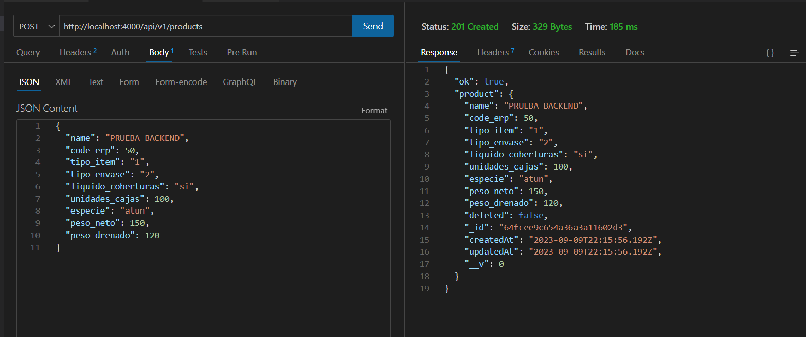
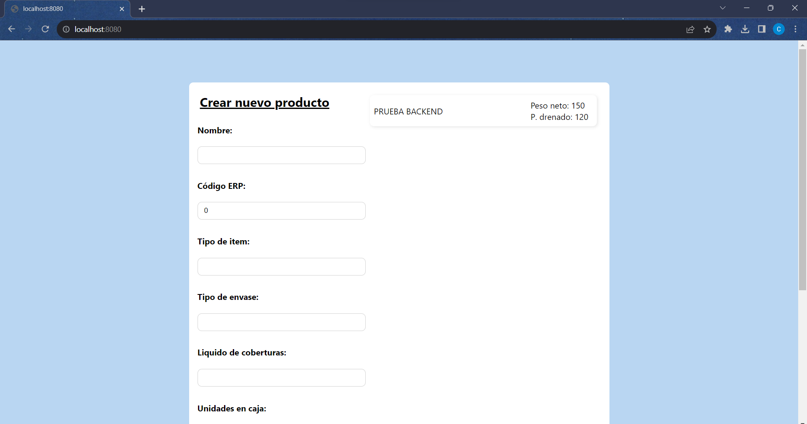
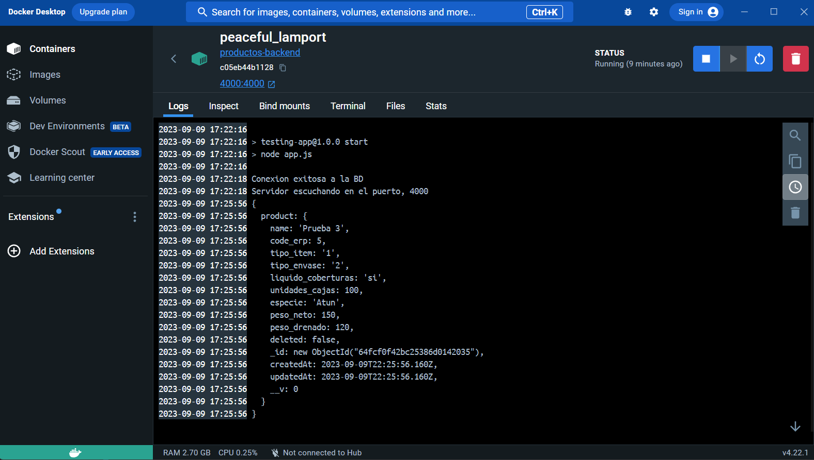

# Taller n°1 
### INTEGRANTES:
- Casanova Castro Julio
- Lino Canales Sergio
- Lucas Lucas Caroline
- Meza Jimenez Winter
- Ponce Moreira Kevin

## Documentacion del taller

Instalar paquetes:

```
npm install
```

Configurar el .env con las variables para la conexión a la base de datos:

- PORT=
- MONGO_DB_PASS=

#### Iniciar en modo desarrollo
Primero, dentro de la carpeta backend:

```
yarn dev
npm run dev
```
En la carpeta frontend:
```
npm start
```
#### Crear Docker

En la terminal, dentro de backend:
```
docker build -t productos-backend .
```

Dentro de la terminal en la carpeta frontend:
```
npm run build
```
```
docker build -t productos .
```
#### Ejecutar el Docker

Dentro de la carpeta backend:
```
docker run -p 4000:4000 productos
```
Dentro de la carpeta frontend:
```
docker run -p 8080:3000 productos-frontend
```
## Pruebas de Ejecución
- Envio de datos desde el backend usando el método POST


- Ejecucion y envio de datos del Frontend


- Envio de datos ejecutando desde Docker
