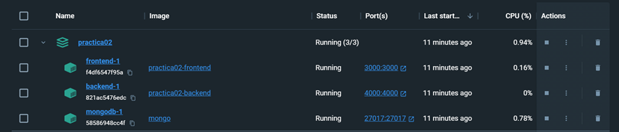
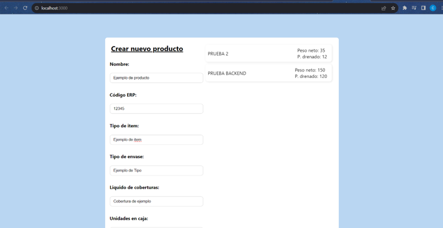
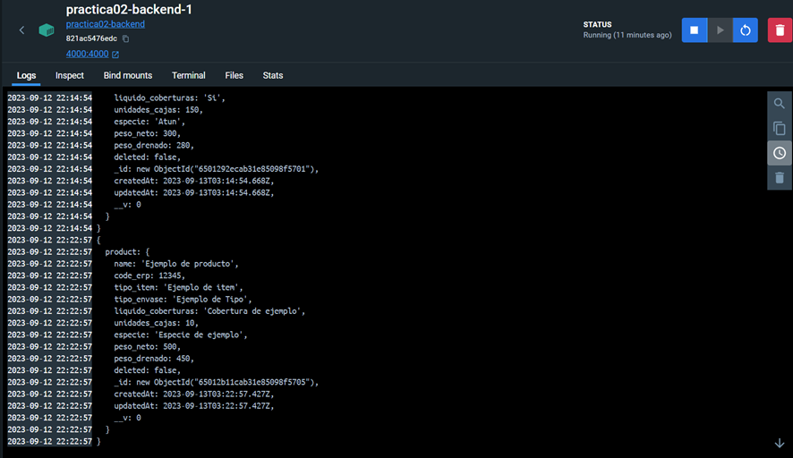
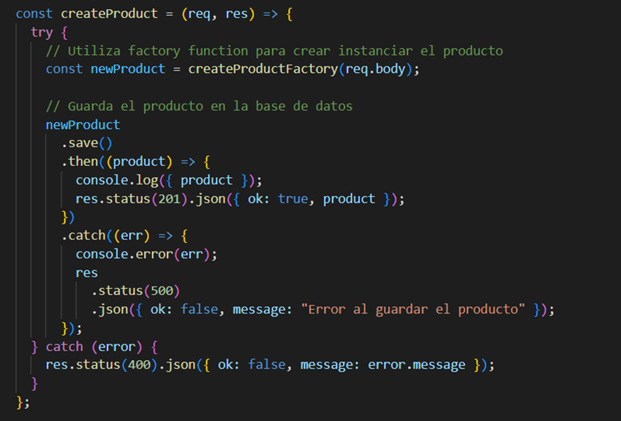

# Taller n°2 
### INTEGRANTES:
- Casanova Castro Julio
- Lino Canales Sergio
- Lucas Lucas Caroline
- Meza Jimenez Winter
- Ponce Moreira Kevin

## Documentacion del taller

Instalar paquetes:

```
npm install
```

Configurar el .env con las variables para la conexión a la base de datos:

- PORT=
- MONGO_DB_PASS=

#### Crear Docker


Dentro de la terminal en la carpeta frontend:
```
npm run build
```
En el nivel donde se encuentra el documento docker-compose.yaml
```
docker-compose up -d --build backend
docker-compose up -d --build frontend
```
#### Ejecutar el Docker
Utilizado -d para que se ejecute en segundo plano
```
docker-compose up -d
```
## Pruebas de Ejecución
- Ejecucion del contenedor Docker


- Ejecucion del programa desde el docker


- Ingreso de datos en la base de datos usando el docker en tiempo real


- Factory Function utilizada para el ingreso de datos
