# Taller n°3 
### INTEGRANTES:
- Casanova Castro Julio
- Lino Canales Sergio
- Lucas Lucas Caroline
- Meza Jimenez Winter
- Ponce Moreira Kevin

## Documentacion del taller
### Aplicar servicio REST

#### Entidad Producto
- Metodo GET

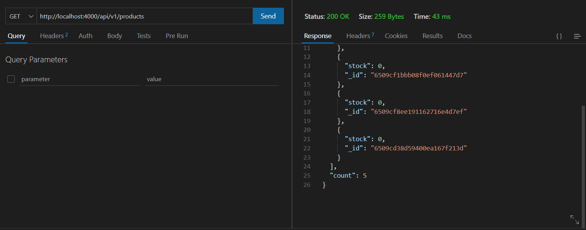

- Metodo POST

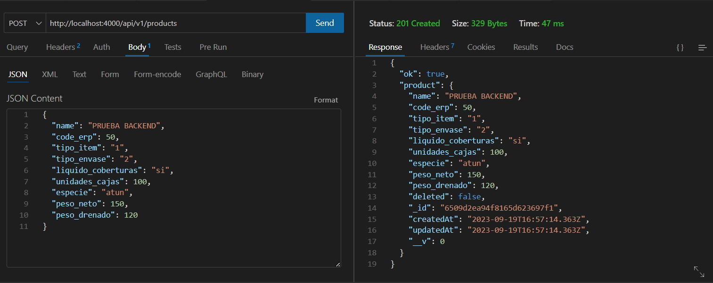

#### Entidad Cliente
- Metodo GET

- Metodo POST

#### Entidad Order Comercial

-Metodo GET

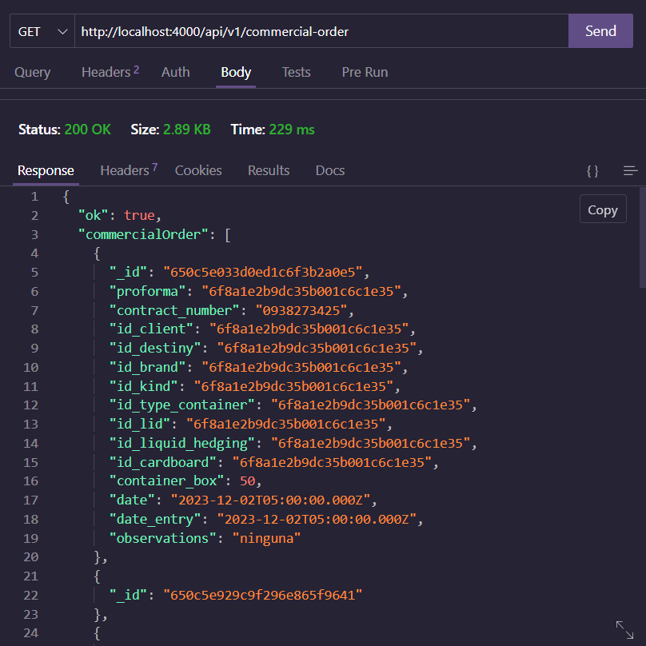

-Metodo POST

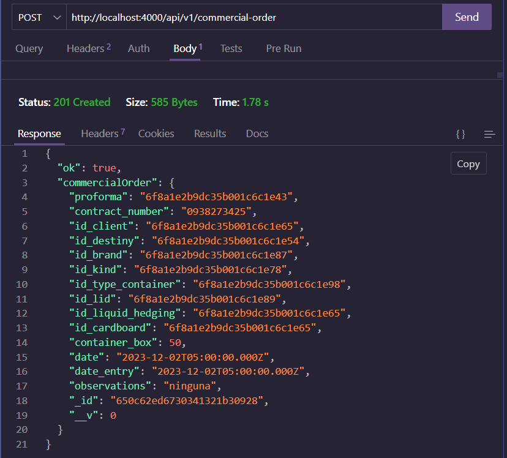

#### Entidad Detalle Orden Comercial
- Metodo POST

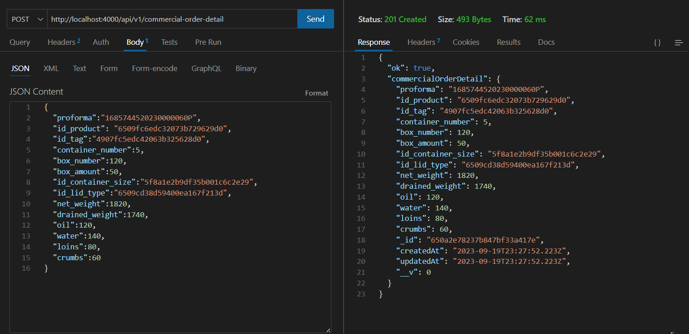

- Metodo GET

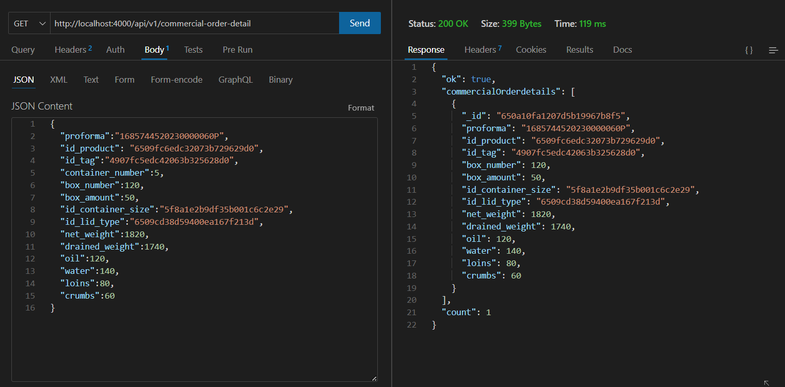

#### Entidad Insumo Requerido
- Metodo POST
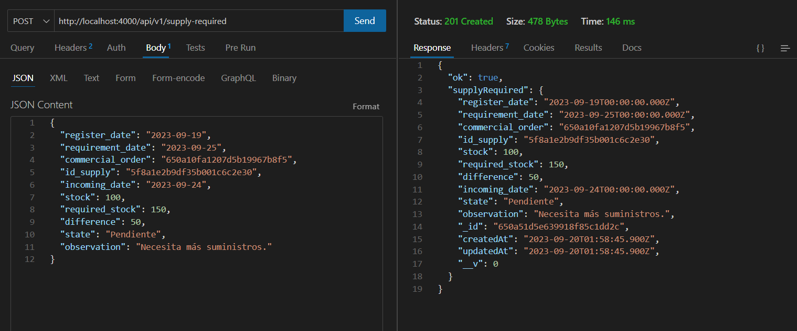

- Metodo GET

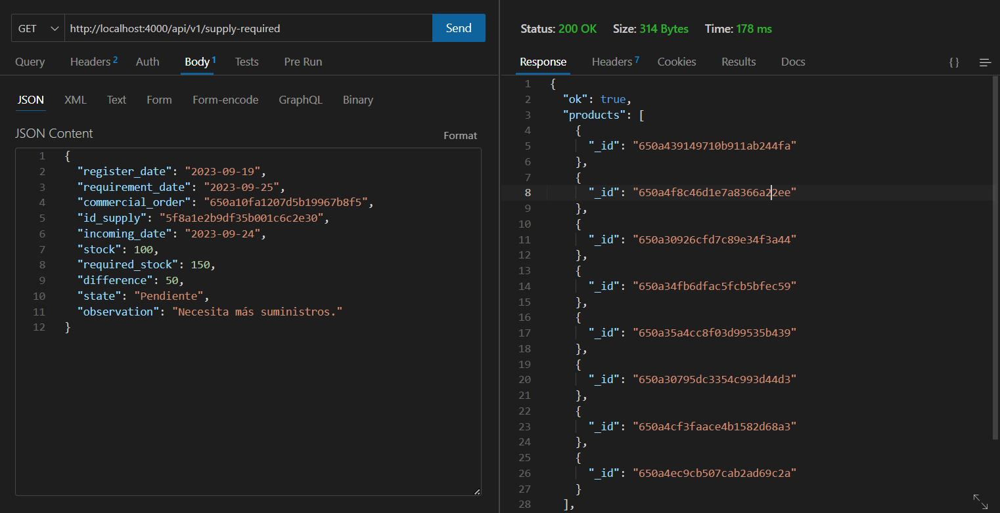

### Ejecucion de pruebas unitarias 
#### Entidad Productos

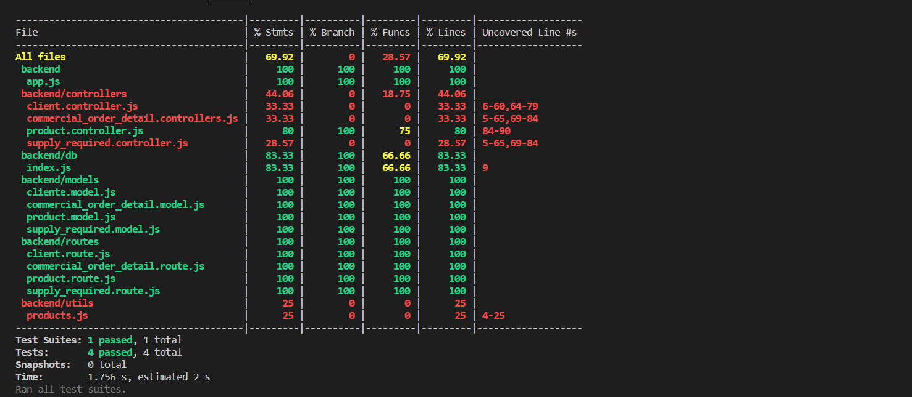

#### Entidad Cliente

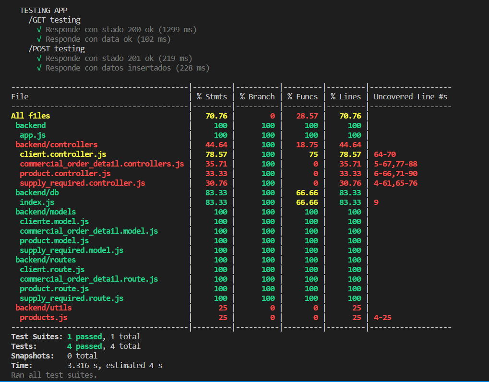

#### Entidad Detalle Orden Comercial
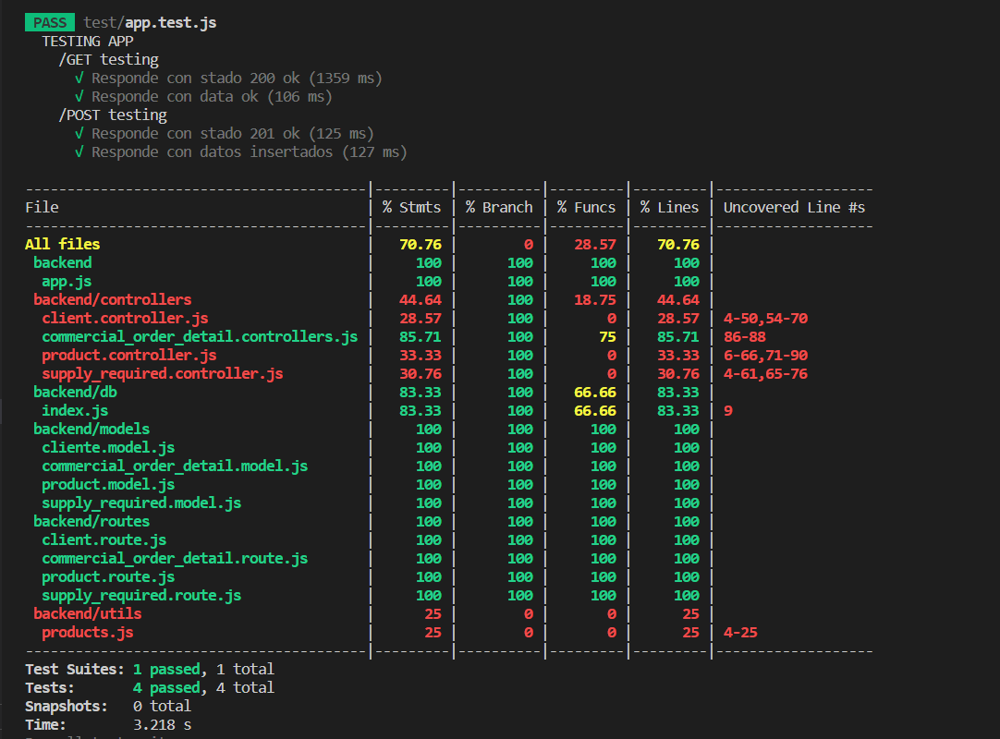

#### Entidad Orden Comercial
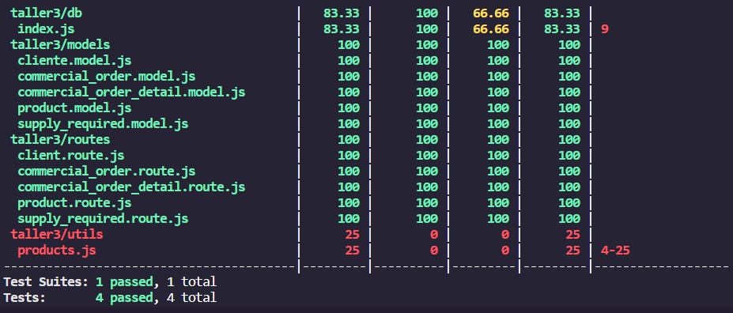

#### Entidad Insumo Requerido
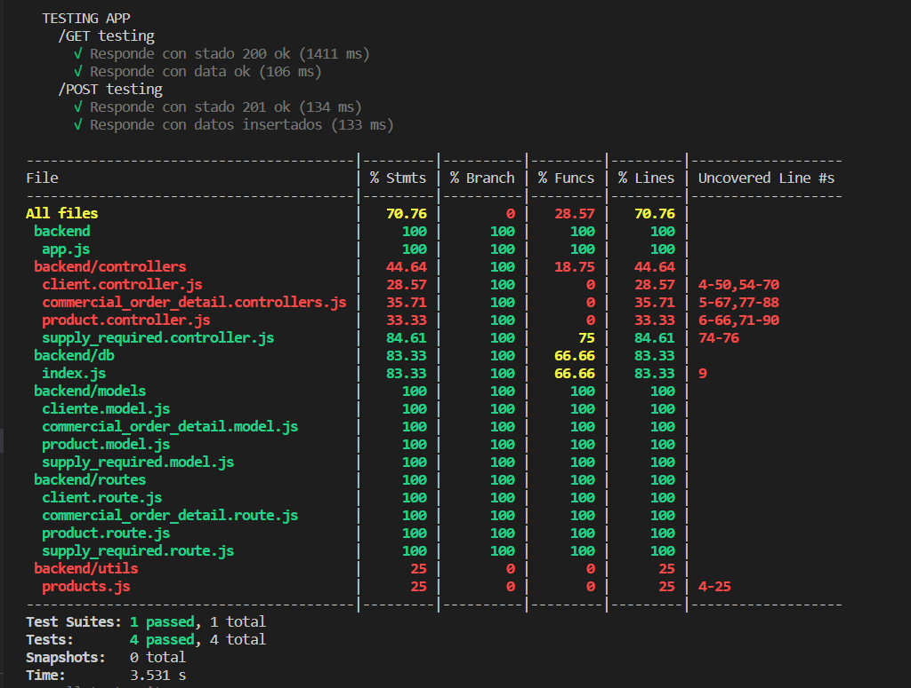

### Desarrollo de Docker 
#### Creacion del multistage
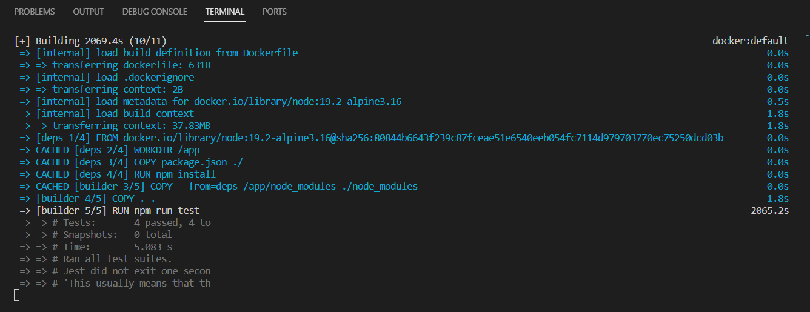

#### Subida a Docker Hub
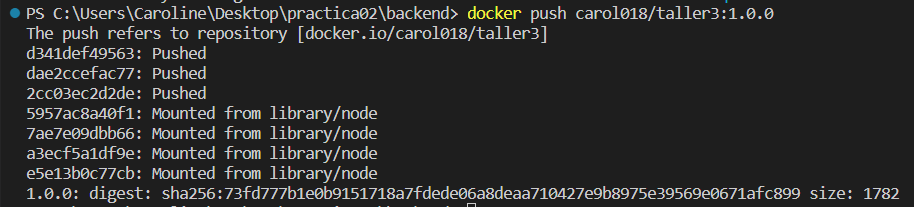

#### Repositorio creado en Docker Hub
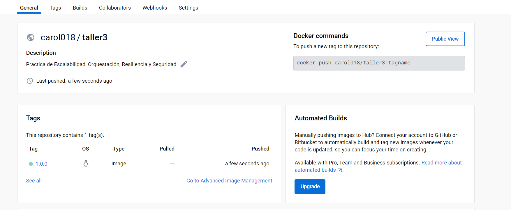
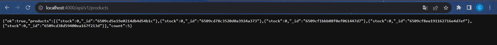

