# Taller n°4 
### INTEGRANTES:
- Casanova Castro Julio
- Lino Canales Sergio
- Lucas Lucas Caroline
- Meza Jimenez Winter
- Ponce Moreira Kevin

## Documentacion del taller

### Definir configuraciones y secretos para los parámetros de la base de datos y servicio REST.
- Definir configuraciones en MongoDB

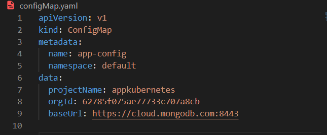

- Definir los secretos 

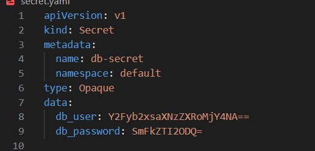

### Definir el Deployment y el Service para levantar su base de datos
- Crear el deployment de la base de datos

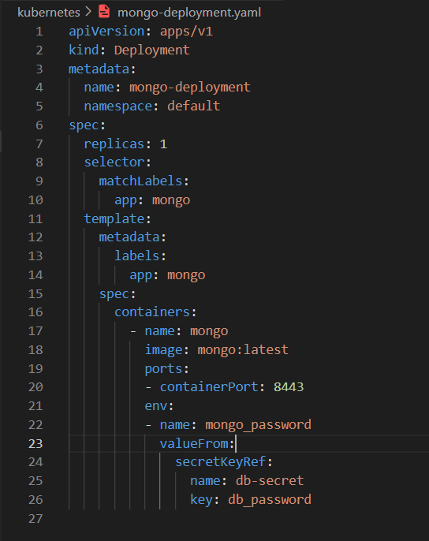

- Crear el service con los puertos y protocolos usados

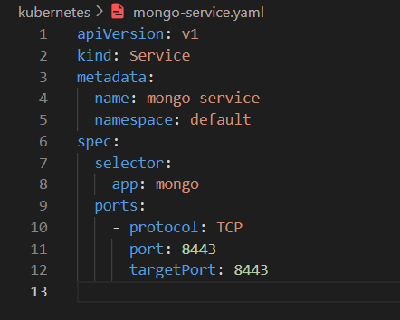

### Definir el Deployment y el Service para levantar el servicio REST.
- Crear el deployment del servicio REST

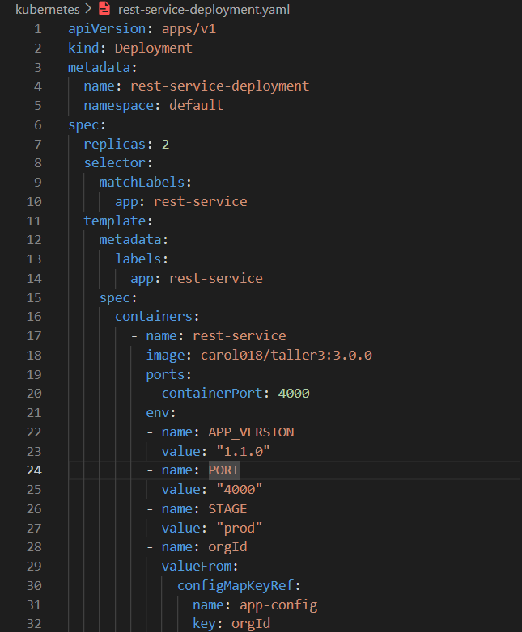 

- Definir el service

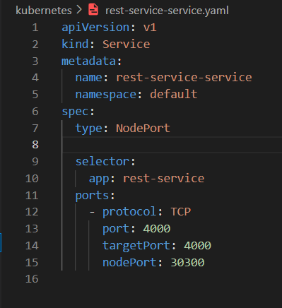

### Aplicar la configuracion de los archivos

- Configuraciones y secretos
```
kubectl apply -f configmap.yaml
kubectl apply -f secret.yaml
```
- Deployment y Service de Mongo
```
kubectl apply -f kubernetes/mongo-deployment.yaml
kubectl apply -f kubernetes/mongo-service.yaml
```
- Deployment y Service del servicio Rest
```
kubectl apply -f kubernetes/rest-service-deployment.yaml
kubectl apply -f kubernetes/rest-service-service.yaml
```
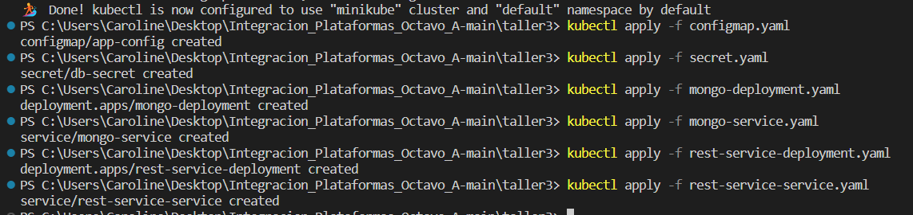

### Mostrar el estado de la configuración
```
kubectl get all -n default
```
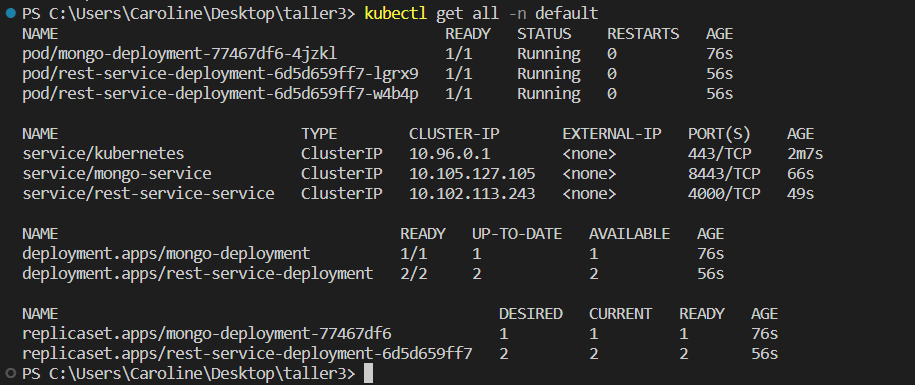

### Obtener el log de un objeto especifico
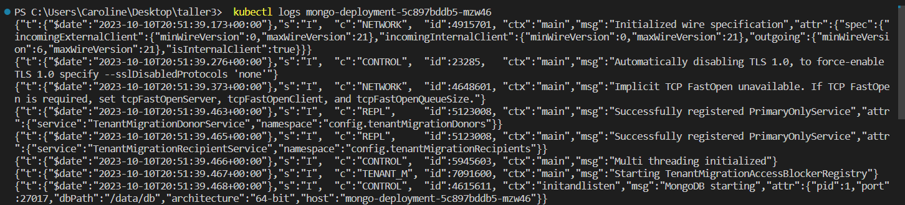

### Exponer el servicio para probarlo
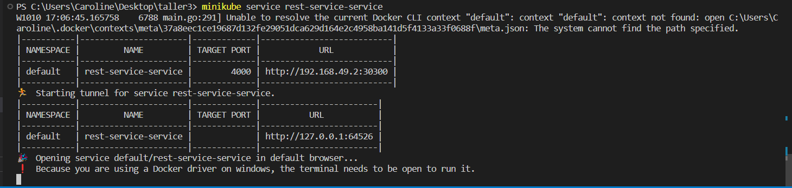

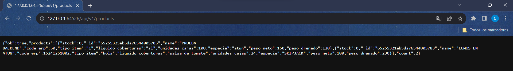

