***
# Taller 4 - Segundo Parcial
- SEGUNDO PARCIAL: TALLER 04.
- Facultad: Ciencias de la Vida y Tecnología.
- Carrera: Ingeniería en Tecnologías de la Información.
- Curso: Noveno "A" 2023(2).
- Docente: Ing. Jhon Antonio Cevallos Macías, Mg.

### ESTUDIANTE:

- Nombres y Apellidos: Winter Aníbal Meza Jiménez.
***
## Link del REPOSITORIO:

https://github.com/WinterMeza/prueba_1

## Documentacion del taller
### Crear un Repositorio
El paso inicial involucra establecer un nuevo repositorio en GitHub y luego cargar el código fuente.

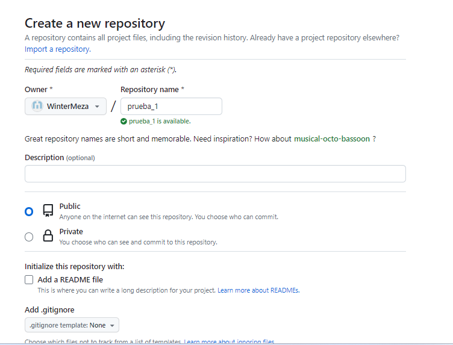

### Utilizando Comandos
Empleamos comandos específicos para cargar el código fuente al repositorio.

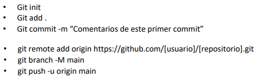
Código fuen te subido al repositorio.

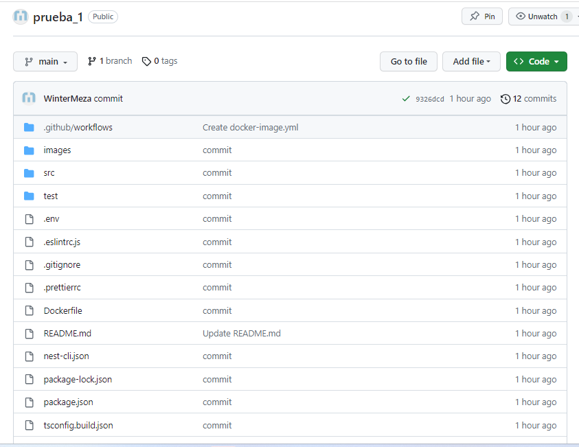

### Crear Docker_User y Docker_Password

Configurar los secretos `Docker_User` y `Docker_Password` en GitHub para asegurar la autenticación.

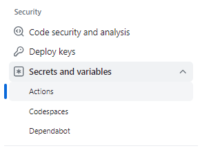

Agregamos un nuevo secret y luego tendremos los secrets creados dentro del repositorio.

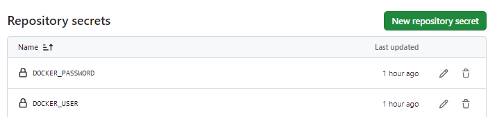

### Generación de Token en Docker Hub

Es necesario crear un token en Docker Hub, el cual deberá ser copiado para su uso posterior como `Docker_Password`.

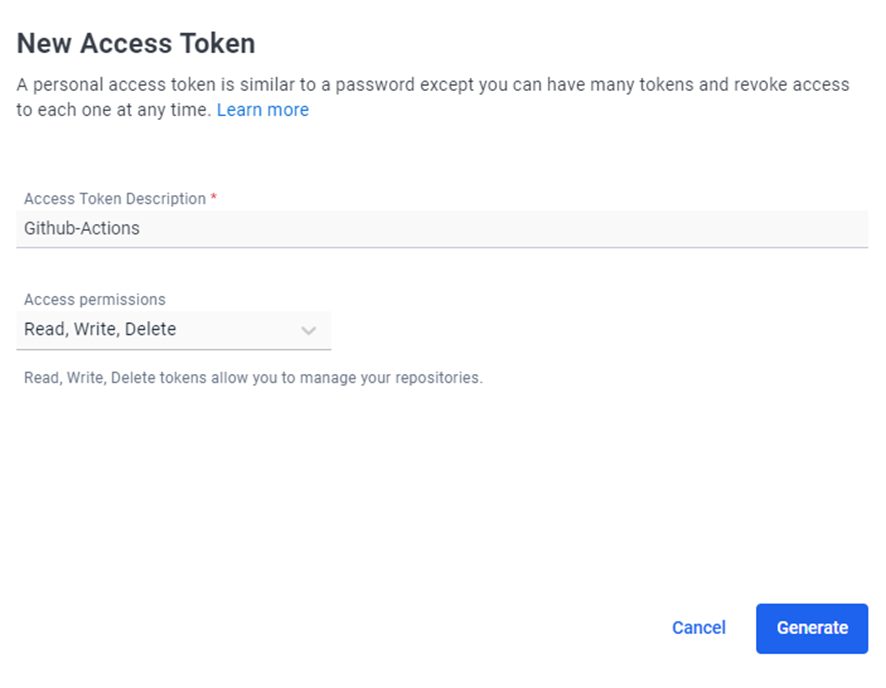

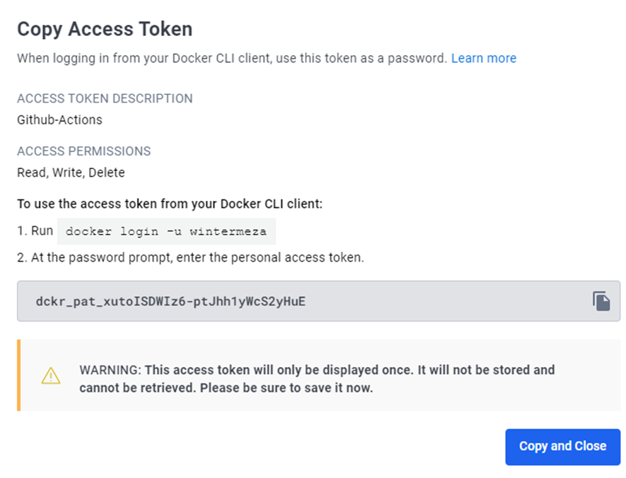

Token creado en Docker Hub

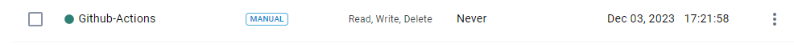

### Docker y Docker Hub

Dockerizamos el codigo y creamos la imagen en Docker Hub:

```
docker build --target dev-deps -t tagname .
```
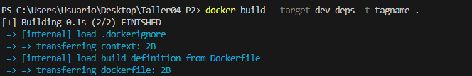

```
docker build --target builder -t tagname .
```
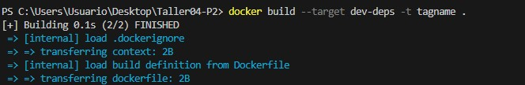

```
docker build --target prod-deps -t tagname .
```

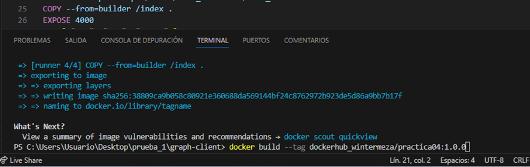

```
docker build --target prod -t tagname .
```
```
docker build --tag wintermeza/practica04:latest
```
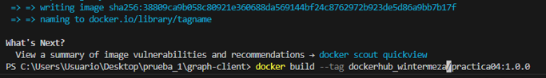

```
docker push wintermeza/practica04:latest
```
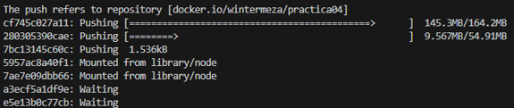

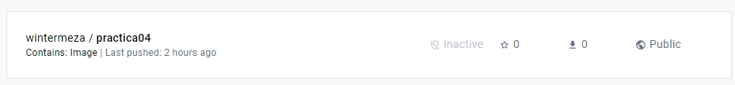

### Agregar el Workflow

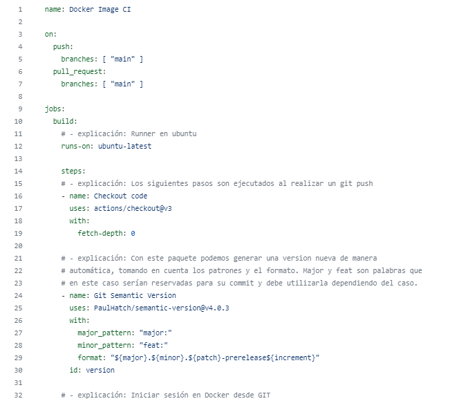

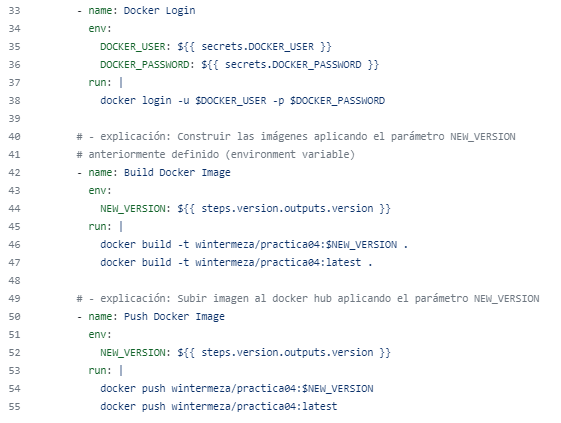

Realizamos cambios en el repositorio para mostrar que el Actions y el Docker Hub realizan los cambios correctamente

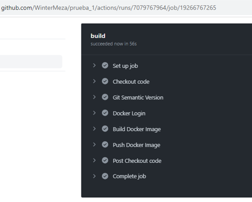

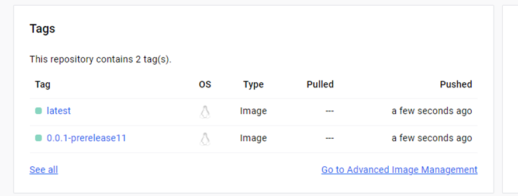
